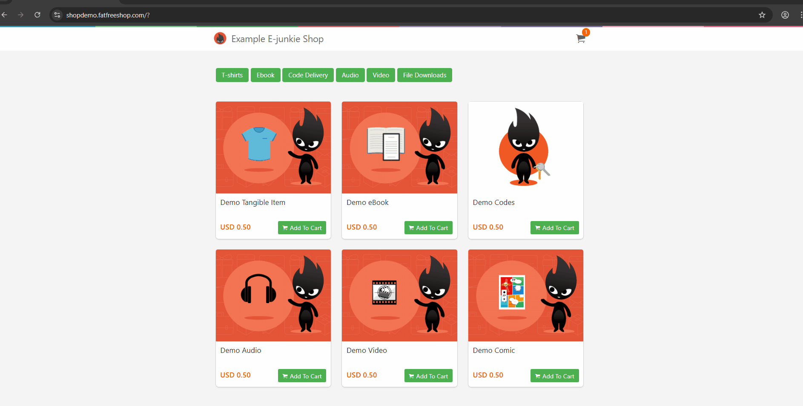
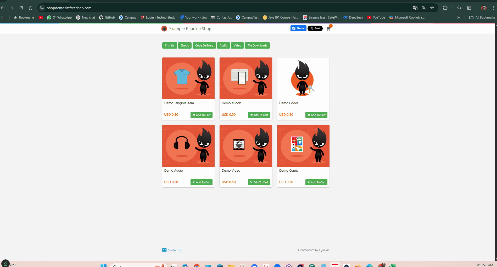
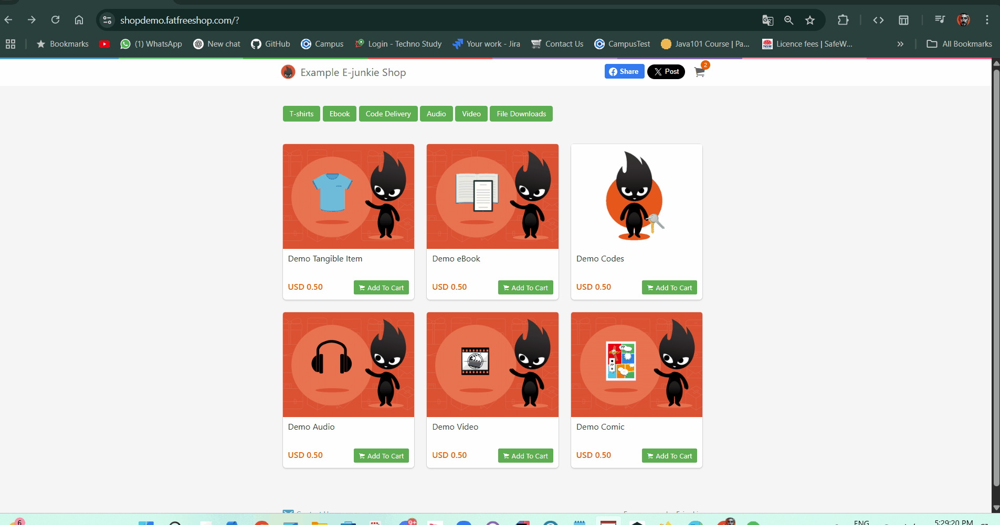
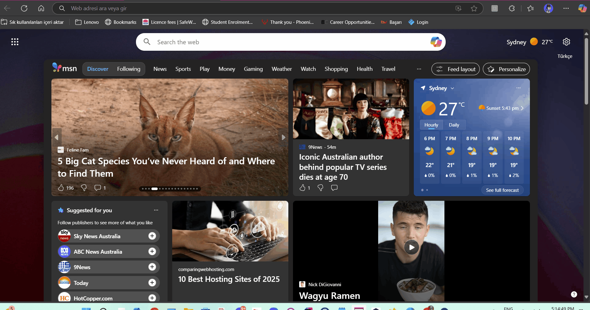
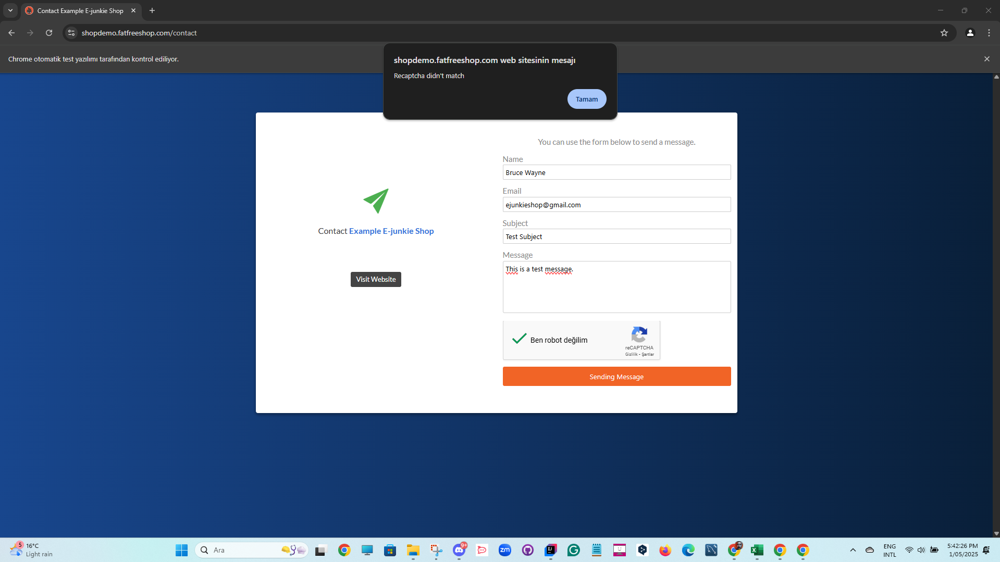

# 🧪 E-Junkie Cucumber Automation Project

## 📌 Table of Contents

- [Project Description](#project-description)
- [Project Structure](#project-structure)
- [Technologies Used](#technologies-used)
- [Installation](#installation)
- [Usage](#usage)
- [Dependencies](#dependencies)
- [User Stories & Test Scenarios](#user-stories--test-scenarios)
- [Test Coverage Table](#test-coverage-table)
- [Test Reports](#test-reports)
- [Bug Reports](#bug-reports)
- [Project Team](#project-team)
- [GitHub Links](#github-links)
- [License](#license)
- [Contact](#contact)

---

## 📄 Project Description

This project automates functional UI tests for the [E-Junkie demo shop](https://shopdemo.e-junkie.com/) using **Java**,
**Selenium WebDriver**, **Cucumber**, **TestNG**, and the **Page Object Model (POM)**.
The project adopts BDD principles and parallel test execution for scalable automation.

💪 Key Features:

- **Cucumber with Gherkin syntax** for human-readable test cases
- **TestNG + XML execution** with browser parameterization
- **Thread-safe WebDriver management** with `ThreadLocal`
- **ExtentReports Integration** for both HTML and PDF reporting
- **Apache POI** for exporting test results to Excel

---

## 🏠 Project Structure

```plaintext
E-JunkieDemoShopProject_Cucumber/
├── src/
│   └── test/
│       │
│       ├── java/
│       │   ├── featureFiles/                # .feature files written in Gherkin
│       │   ├── hooks/                       # Cucumber Hooks (Before/After)
│       │   ├── pages/                       # Page Object Model classes
│       │   ├── runners/                     # TestNG runner classes
│       │   │   └── XML/                     # TestNG XML configuration files
│       │   ├── stepDefinitions/             # Cucumber step definitions
│       │   └── utilities/                   # Driver, ConfigReader, ExtentReportManager, etc.
│       └── resources/
│           ├── fonts/                       # Fonts used in reports
│           ├── extent.properties            # ExtentReports configuration
│           └── pdf-cucumber-report-config.yaml
├── testGifs/                                # GIFs used in reports
├── testReports/                             # Spark & PDF report output (auto-generated)
├── configuration.properties                 # General test configuration
├── pom.xml                                  # Maven build configuration
└── README.md
```

---

## 🧰 Technologies Used

| Tool / Library                       | Description                        |
|--------------------------------------|------------------------------------|
| Java JDK 21                          | Programming Language               |
| Selenium WebDriver 4.20.0            | Web Automation Library             |
| Cucumber 7.15.0                      | BDD Testing Framework              |
| TestNG 7.9.0                         | Test Execution Engine              |
| ExtentReports 5.1.1 + Adapter 1.14.0 | Spark + PDF reporting integration  |
| Apache POI 5.2.5                     | Excel File Handling                |
| Maven                                | Project Build + Dependency Manager |
| SLF4J + Log4j                        | Logging                            |

---

## 🚀 Installation

1. Clone the repository:
   ```bash
   git clone https://github.com/zaferatakli/E-JunkieDemoShopProject_Cucumber.git
   ```
2. Open the project in **IntelliJ IDEA** or your preferred IDE.
3. Run:
   ```bash
   mvn clean install
   ```

---

## 🛠️ Usage

- To execute **all tests** with default configuration:
  ```bash
  mvn test
  ```
- To run **specific browser tests**:
    - Open `singleBrowserTesting.xml` or `parallelBrowserTesting.xml` in the `runners/XML/` folder.
    - Right-click and run the XML file.

---

## 📦 Dependencies

All required dependencies are declared in `pom.xml`.
Ensure Maven updates all packages automatically.

Key dependencies include:

- Selenium
- Cucumber Java & TestNG
- ExtentReports (Spark & PDF)
- Apache POI
- Jackson Databind

---

## 🧰 User Stories & Test Scenarios


### **1️⃣ US_301 - Add eBook to cart & invalid promo code**
📌 As a customer, I want to add an eBook to the basket and try applying an invalid promo code, so I can check whether the system correctly displays the "Invalid promo code" warning.

✅ Expected: "Invalid promo code" warning message is displayed after clicking “Apply.”

✅ Actual: After adding the eBook to the basket and entering an invalid promo code, the system displayed the warning message "Invalid promo code" upon clicking “Apply.”


### **2️⃣ US_302 - Payment attempt with missing information**
📌 As a customer, I want to attempt payment without entering required fields like email or billing name, so I can confirm that the form validations are triggered.

✅ Expected: "Invalid email" and "Invalid billing name" error messages are displayed.

✅ Actual: When the required fields like email and billing name were left empty, the system triggered the form validations and displayed the error messages "Invalid email" and "Invalid billing name."



### **3️⃣ US_303 - Invalid card number payment attempt**
📌 As a customer, I want to enter a fake card number during payment so I can verify that the system blocks invalid card details.

✅ Expected: "Your card number is invalid" warning appears.

✅ Actual: When a fake card number was entered, the system correctly blocked the payment and displayed the warning message "Your card number is invalid."



### **4️⃣ US_304 - Successful payment with valid card**
📌 As a customer, I want to complete the payment with valid card details so I can receive confirmation of a successful purchase.

✅ Expected: "Your order has been confirmed. Thank you!" is displayed.

✅ Actual: The payment was completed successfully with valid card details, and the message "Your order has been confirmed. Thank you!" was displayed.


### **5️⃣ US_305 - Can user download the eBook?**
📌 As a customer, I want to be able to download the eBook immediately after a successful purchase.

✅ Expected: File download starts and matches the purchased content.

✅ Actual: The eBook download started immediately after the successful purchase and matched the purchased content.


### **6️⃣ US_306 - Submit contact form**
📌 As a customer, I want to send a message through the contact form to get support, and if CAPTCHA is not verified, I should be warned.

✅ Expected: "Recaptcha did not match" error message appears.

✅ Actual: "Recaptcha did not match" error message appeared.



### **7️⃣ US_307 - Access main e-junkie page**
📌 As a customer, I want to navigate from the demo site to the official e-junkie homepage to verify the redirection works correctly.

✅ Expected: Final URL matches e-junkie.com.

✅ Actual: Final URL matched e-junkie.com.



### **8️⃣ US_308 - Access 'How it works' video**
📌 As a customer, I want to play the 'How it works' video and ensure it starts, plays for 10 seconds, and closes properly.

✅ Expected: Video plays and closes after 10 seconds.

✅ Actual: The video started playing successfully, continued for 10 seconds, and closed as expected without any issues.


---


## 🧰 User Stories & Test Scenarios

| User Story | Description                            | Status   |
|------------|----------------------------------------|----------|
| US_301     | Add eBook and apply invalid promo code | ✅ Passed |
| US_302     | Payment attempt with missing info      | ✅ Passed |
| US_303     | Payment with fake card                 | ✅ Passed |
| US_304     | Successful payment with valid card     | ✅ Passed |
| US_305     | eBook download after purchase          | ✅ Passed |
| US_306     | Contact form captcha validation        | ✅ Passed |
| US_307     | Logo click navigates to homepage       | ✅ Passed |
| US_308     | Play and close "How it works" video    | ✅ Passed |

---

## 📊 Test Coverage Table

| Scenario                          | Priority |
|-----------------------------------|----------|
| Add to cart + invalid promo       | Medium   |
| Missing email or name in payment  | High     |
| Fake card number                  | High     |
| Valid payment and success message | High     |
| eBook download available          | High     |
| Contact form without captcha      | Medium   |
| Homepage redirection              | Low      |
| Video functionality               | Low      |

---

## 📊 Test Reports

| Report Type      | Description                             |
|------------------|-----------------------------------------|
| **Spark Report** | Rich HTML report with steps/screenshots |
| **PDF Report**   | Clean summary with scenario results     |

Find reports inside:

```bash
/Test Reports/test-output/SparkReport/

```

---

## 📅 Bug Reports

US_306 - Contact form captcha validation Positive test failed.



---

## 👥 Project Team

| Name         | Role                       | User Stories   |
|--------------|----------------------------|----------------|
| Zafer Ataklı | Project Lead & QA Engineer | US_306, US_307 |
| Rıfat Batır  | QA Engineer                | US_304, US_305 |
| Azim Korkmaz | QA Engineer                | US_302         |
| Nuri Öztürk  | QA Engineer                | US_308         |
| Tugba Kilic  | QA Engineer                | US_301, US_303 |

---

## 🔗 GitHub Links

- 📁 [Main Repository](https://github.com/zaferatakli/E-JunkieDemoShopProject_Cucumber)

**Contributors:**

- [Zafer Ataklı](https://github.com/zaferatakli)
- [Rıfat Batır](https://github.com/rftbtr)
- [Tugba Kilic](https://github.com/TugbaKilic33)
- [Nuri Öztürk](https://github.com/NuriOzturk)
- [Azim Korkmaz](https://github.com/AzimKorkmaz)

---

## 📜 License

This project is licensed under the [MIT License](https://opensource.org/licenses/MIT).

---

## 📧 Contact

For any questions or suggestions, please reach out via GitHub or team leads listed above.

---